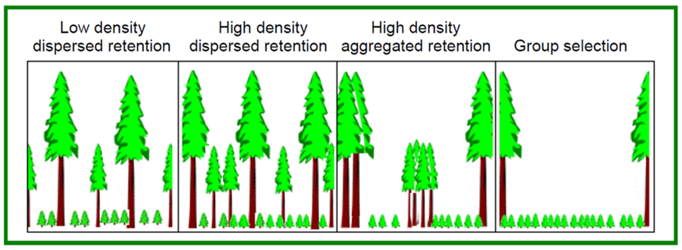
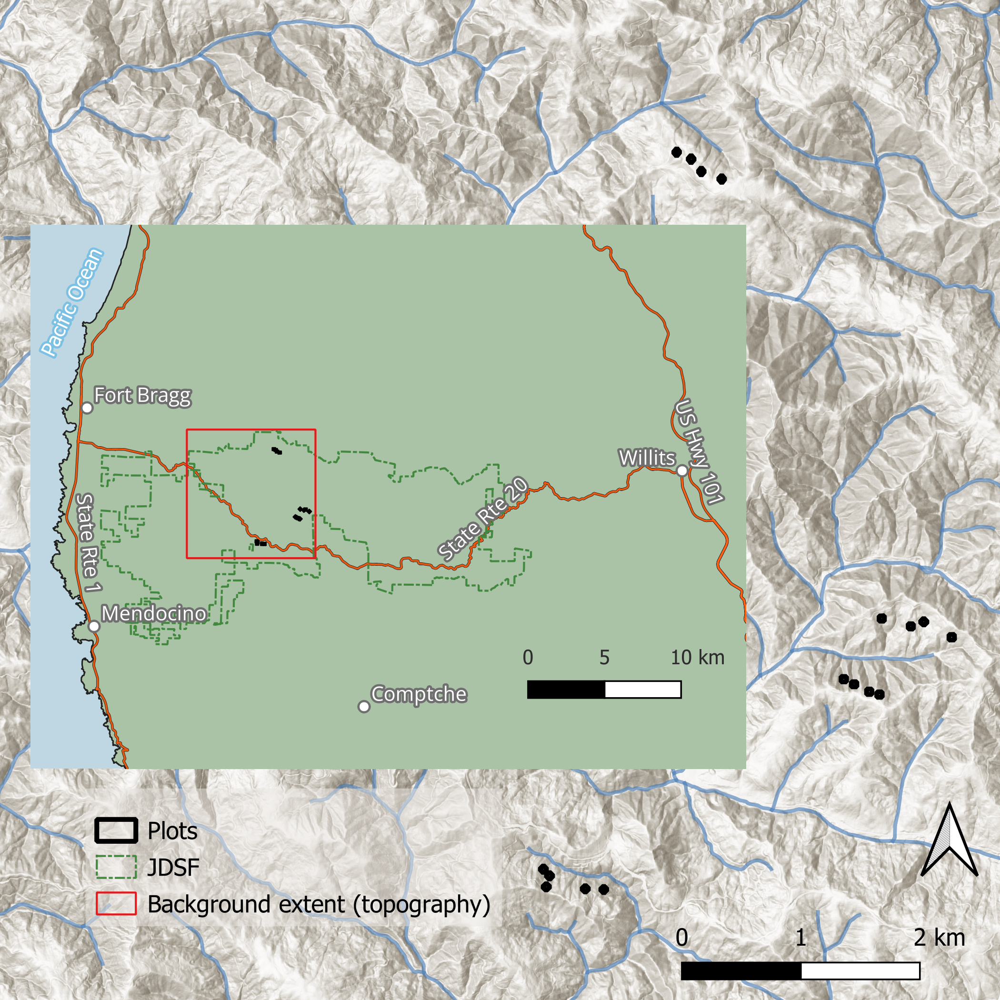
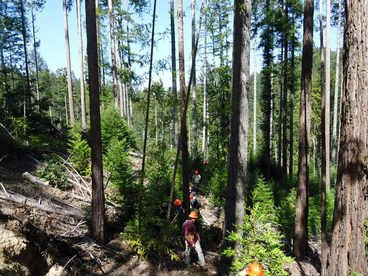
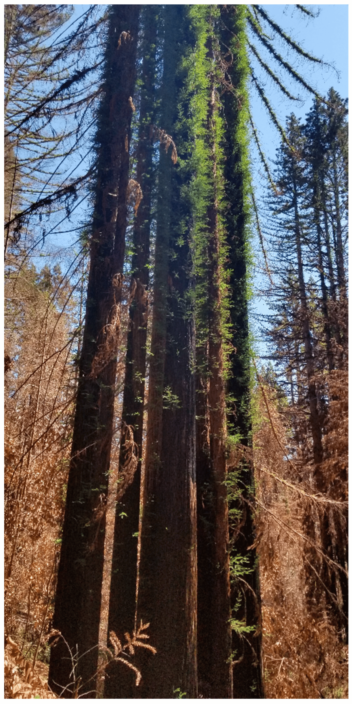
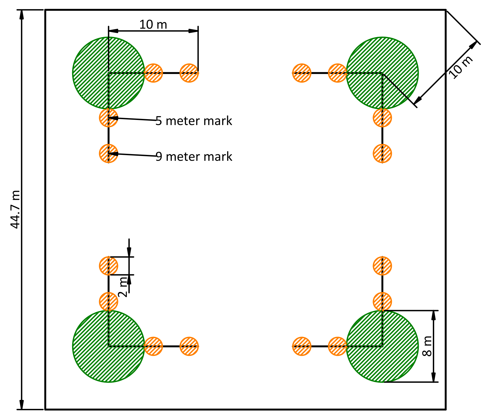
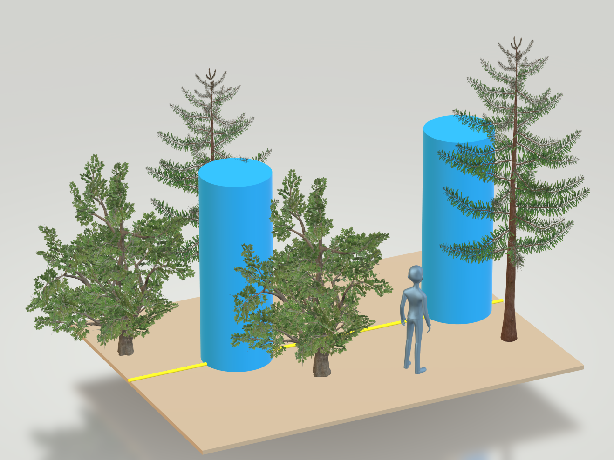
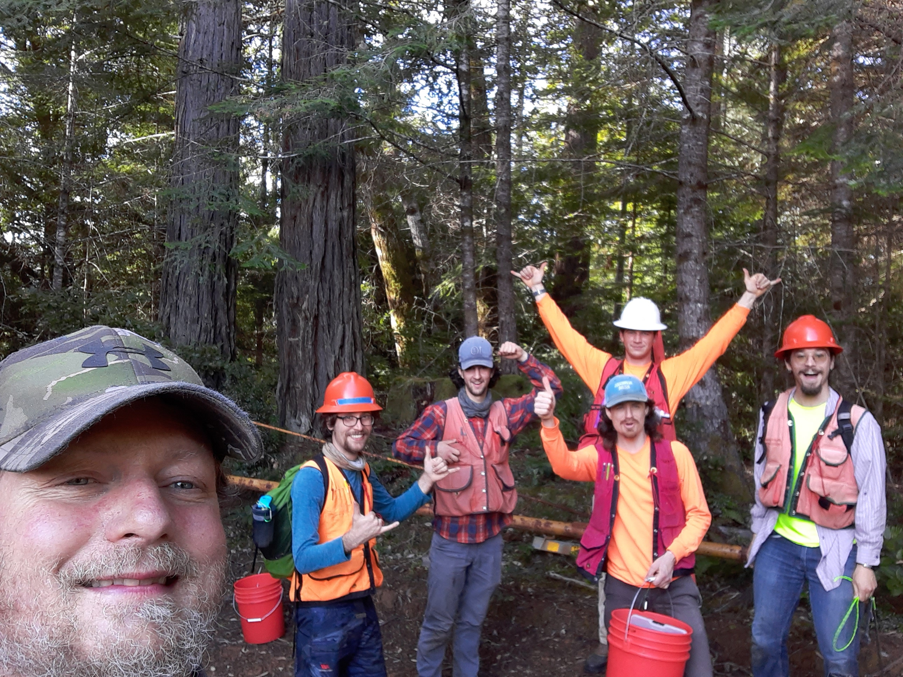
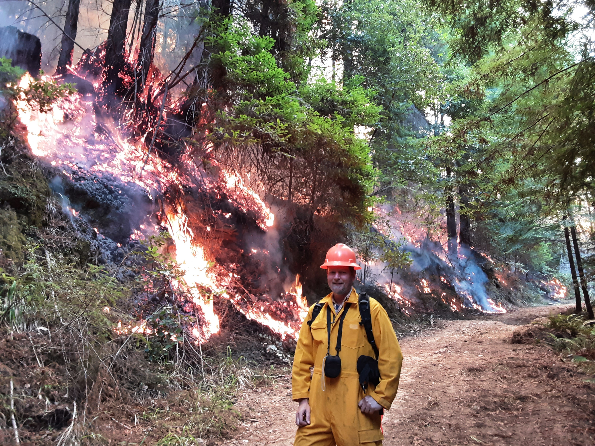

## {style="text-align: center"}

```{r}
#| include: false

library(ggplot2)
library(patchwork)
load("./thesis_defense_plots.rda")

result_theme <- theme(
  plot.background = element_rect(fill = 'transparent', color = NA),
  panel.background = element_rect(color = NA),
  text = element_text(size = 20),
  plot.title = element_text(size = 20)
)

fig_theme <- theme(
  plot.background = element_rect(fill = 'transparent', color = NA),
  panel.background = element_rect(color = NA),
  strip.background = element_rect(fill = 'transparent')
)
```

### Regeneration and Fuel Loading with Varying Overstory Retention in Redwood Stands 10 Years after Transformation to Multiaged Management 

Thesis defense presentation by Judson Fisher



::: {.notes}
Thank you all for being here today.
:::

---

::: {.columns}
::: {.column width=35%}

### A multiaged silviculture experiment

:::

::: {.column width=65%}



:::
:::

::: {.notes} 

10 years ago, Pascal implemented a first of its kind, large scale,
replicated, manipulative silvicultural experiment to demonstrate and study the
transformation from even-aged to multiaged management in redwood dominated
forests in the Jackson Demonstration State Forest in Mendocino County. My thesis
serves as a 10-year report of the remeasurement of several key factors of that
experiment --- sprout heights, regeneration density, and fuels.

Why study multiaged management?
:::

## An important approach to ecological forest management

- Diversity of silvicultural techniques → Diversity of forest structures 
- Growing interest in transformation to multiaged management
- This work contributes to our understanding of multiaged stand development
- First replicated multiaged redwood experiment in the redwood region

::: {.notes}

A diversity of silvicultural techniques supports ecological diversity in managed
forests, which, in turn, promotes resilience and sustainability.

There is widespread interest in transformation of legacy even-aged stands to
multiaged silviculture.

But there are no other existing studies on multiaged management in the redwood
region.

So why does multiaged management make sense for redwood forests in particular?
:::

## Suitability of redwood forests

:::: {.columns}
::: {.column width=40%}
- Timber value
- Shade tolerance
- Reliable regeneration
:::
::: {.column width=60%}

:::
::::

::: {.notes}

Redwood forests are highly productive and actively managed timber.

Their high timber value affords flexibility in management decisions.

They are shade tolerant and regenerate reliably, which are
prime qualities if you are trying to initiate new cohorts under older ones.

So, redwood systems have a lot of the characteristics we want for multiaged
management.

But these systems also exist in a fire-adapted landscape, and that raises an
important question…
:::

## Fire-informed management

::: {.columns}
::: {.column width=70%}

- Slow adoption of fire-informed management on the North Coast
- Redwood is a fire-adapted species
- Historical record shows frequent fire
- We need to understand the pyrosilvicultural significance of our management.

:::
::: {.column width=30%}
{height=500}
:::
:::

::: {.notes}
Although fire is not always the first thing we think when we think of the foggy
coastal climate where redwoods thrive, multiple lines of evidence indicate that
these forests are no stranger to fire.

But we don't really understand how management approaches interact with fuels and
fire in these systems.

So I built metrics into a first-of-its-kind experiment to improve our
understanding of the role fire might play in transformation to multiaged
management.
:::

## Methods --- implementation {.center}

::: {.notes}
Now that you have and idea of the what and why, I'll explain more of the details
of how we implemented the experiment and how I collected and analyzed the data.

We'll start with implementation of the initial harvest in 2012
:::


## Initial harvest --- 2012

::: {.columns}
::: {.column width=60%}

- 16 two-hectare blocks, each with one 1/5-ha macro plot 
  - **GS**: Group selection
  - **LD**: Low density dispersed
  - **HA**: High density aggregated 
  - **HD**: High density dispersed

These four treatments were replicated across four sites.

:::
::: {.column width=40%}
```{r, dev="png", dev.args=list(bg="transparent")}
#| fig-width: 4
#| fig-height: 6

source("./scripts/design.r")
experiment_design("macro") + fig_theme + ggtitle("Macro plots")
```
:::
:::

::: {.notes}
Four treatments (harvest intensities) were designed to reproduce a range
of understory light conditions expected to promote conifer regeneration.

They are listed here in order from least, to greatest amount of overstory
competition for light and growing space.

At each of four replicate sites, the four treatments were implemented within
2-ha treatment blocks.

Then, we installed one 1/5-ha plot within each treatment block.

Next
:::

## The treatments are defined in terms of retained trees after harvest


[13% RD]{.absolute bottom=110 left=60}
[21% RD]{.absolute bottom=110 left=290}
[21% RD]{.absolute bottom=110 left=510}
[0% RD]{.absolute bottom=110 left=730}

::: {.notes}

The high-density treatments targeted retaining about 21% of the sites estimated
total growing capacity in overstory trees --- **relative density**. The low density
treatments targeted 13% RD.

Next
:::

## One site{background-color="black" background-image="../figures/treatments_aerial_labeled.png" background-size="contain"}

::: {.notes}
This is what the four treatments look like from above at one of our four sites.

Our measurement plots are outlined in red.

Notice how you can see more ground in low-density dispersed treatment, and
somewhat more ground in the high-density aggregated treatment area, whereas in
the high-density dispersed plot, no ground is visible.

Next, we'll see how the treatments looked like from the ground.
:::

## {background-color="black" background-image="../figures/GS.jpg" background-size="contain"}
::: {.absolute bottom="5%" right="5%"}
[GS]{style="font-size: 2em;"}
:::
::: {.notes}
group selection
:::

## {background-color="black" background-image="../figures/LD.jpg" background-size="contain"}
::: {.absolute bottom="5%" right="5%"}
[LD]{style="font-size: 2em;"}
:::
::: {.notes}
low-density dispersed
:::

## {background-color="black" background-image="../figures/HA.jpg" background-size="contain"}
::: {.absolute bottom="5%" right="5%"}
[HA]{style="font-size: 2em;"}
:::
::: {.notes}
high-density aggregate

Notice the freshly downed slash in the foreground. 
:::

## {background-color="black" background-image="../figures/HD.jpg" background-size="contain"}
::: {.absolute bottom="5%" right="5%"}
[HD]{style="font-size: 2em;"}
:::
::: {.notes}
high-density dispersed
:::

## Pre-commercial thinning (PCT)

tending the understory of the rapidly growing sprouts.

:::: {.columns}
::: {.column width=50%}

:::

::: {.column widht=50%}

:::
::::

::: {.notes}
At this phase of the experiment (year 10), the rapidly growing understory
required tending via a pre-commercial thinning (PCT).

Silviculturally, this creates more growing space for selected sprouts. 

The pyrosilvicultural significance is that this also results in conversion of
potential ladder fuels to dead downed surface fuels.
:::


## Methods --- sampling procedure {.center}

::: {.notes}
Now that you have an idea of what we implemented, lets talk about how I
measured it.

I measured response variables across three categories:

- Regeneration density
- Sprout heights
- Fuels

But before explaining those, I'll start by defining the components of sampling plot structure.
:::

## The plot structure{.smaller}

::: {.columns }
::: {.column style="vertical-align:middle; width:30%;"}

- Macro plot (Outline)
- Regeneration plots ([green]{style="color: green"} circles)
- Fuel transects ([orange]{style="color: orange"} lines)
- Fuel sampling cylinders ([orange]{style="color: orange"} circles)

:::
::: {.column style="vertical-align:middle; width:70%"}

:::
:::

::: {.notes}
- Macroplot: 1/5-ha square, almost 45 meters on a side
- Regeneration plots: 4-m radius circular plots, near the 4 coreners of the
  macros plot
- 10-m fuels transects emmanated at right angels from the center of each
  regeneration plot
- fuel sampling cylinders were located at the 5- and 9-meter marks along each
  transect

Next, I'll describe what we sampled in each of these.

We'll start with the regen sub-plots.
:::

## Regeneration density and composition

::: {.columns}
::: {.column width=60%}
- Four 4-m-radius sub plots per macro plot
- recorded diameter and species of all sprouts and seedlings taller than 1.4 m
:::
::: {.column width=40%}

```{r, dev="png", dev.args=list(bg="transparent")}
#| fig-width: 3.5
#| fig-height: 3.5
#| fig-align: left

plot_design("regen") + fig_theme
```
:::
:::

::: {.notes}
Here we recorded all sprouts and seedlings taller than 1.4 meters.

These measurements give us an idea of total density and composition across our
plots, but we wanted to quantify the growth of individual sprouts more
precisely.
:::

## Sprout height

::: {.columns}
::: {.column width=60%}

- 1/5 ha square macro plot
- 25 each of tanoak and redwood sprout clumps were selected for measurement
- Tallest sprout in clump measured at years 1, 5, and 10

:::
::: {.column width=40%}
{}


```{r, dev="png", dev.args=list(bg="transparent")}
#| fig-width: 1.5
#| fig-height: 1.5
plot_design("macro")
```
:::
:::

::: {.notes}
Sprout heights were measured across the macro plot

Sprouts were selected in year 1 to be well distributed across the macro plot,
and these were remeasured at years 5 and 10

This gives us a good estimate of individual tree growth response over
time.

These sprouts represent the next cohort in a multiaged silvicultural
system, which is why we are interested in their growth and density.

But they also represent a significant source of potential fuel, given the right
(or wrong) fire-weather conditions.

:::

## Vegetation fuels

:::: {.columns}
::: {.column width=60%}
- We estimated percent cover and average height for:
  - grass and forbs
  - shrubs and trees
- Converted to load using a constant bulk density
:::

::: {.column width=40%}


```{r, dev="png", dev.args=list(bg="transparent")}
#| fig-width: 1.5
#| fig-height: 1.5
#| fig-align: left
plot_design("samp_cyl")
```
:::
::::

::: {.notes}
We weren't quite satisfied with just stem and height measurements, so we
estimated the density of the sprout foliage itself (as well as that of any
shrubs or forbs present).

The sprouts had grown so much that a PCT was necessary, and that slash would
become downed woody fuel, so we wanted to characterize that fuel loading before
and after PCT.
:::

## Downed woody fuel

::: {.columns}
::: {.column width=60%}
- Particles were tallied by size class
- Counts were converted to load (Mg/ha) using linear intersect theory and
  parameters from the literature

```{r, dev="png", dev.args=list(bg="transparent")}
#| fig-width: 1.5
#| fig-height: 1.5
#| fig-align: left
plot_design("transect")
```
:::
::: {.column width=40%}


:::
:::

::: {.notes}
We partook in the time honored tradition of counting sticks on the forest floor
by size class! 

Next
:::

## Litter and duff

::: {.columns}
::: {.column width=60%}
- Litter and duff depth measured from a representative location within the
  sampling cylinder
- Depth-to-load equation taken from the literature
:::
::: {.column width=40%}
```{r, dev="png", dev.args=list(bg="transparent")}
#| fig-width: 3.5
#| fig-height: 3.5
plot_design("samp_cyl")
```
:::
:::

::: {.notes}
And of course you can't ignore leaf litter in these cladoptosising, fire-philic redwood
stands.

So we measured duff and litter depths at each of the sampling cylinders as well.

All this sampling resulted in a lot of walking around the plot, but don't worry,
I was sure to remind the crew often not to step on any sticks!

Ok, Lets review the data we collected.
:::

## Sampling review

```{r, dev="png", dev.args=list(bg="transparent")}
#| fig-height: 4

local({
  title <- function(T) {
    list(
      ggplot2::labs(title = T),
      ggplot2::theme(plot.title = ggplot2::element_text(size = 20))
    )
  }
  plot_design("regen") +
    title("Regen. density") +
    plot_design("macro") +
    title("Sprout heights") +
    plot_design(c("samp_cyl", "transect")) +
    title("Fuels") &
    fig_theme
})
```
::: {.notes}
Here you can see they fall into three neat categories.

Now, with data in hand, we are ready to try to fit them to models.
:::

## Methods --- Analysis {.center}

::: {.notes}
By the end of this section, you'll have an idea of how I approached analysis of
these data.
:::

## Analytical framework

- 16 models across three response categories  
- Multilevel (mixed-effects) models throughout  
- Treatment and species as primary fixed effects
- Random effects reflect study design hierarchy + impact
- Models fit with R package `glmmTMB` = flexibility
- Distribution and variance structure selected using AIC + residual diagnostics
  in `DHARMa`
- Inference based on population-level marginal means with `marginaleffects` and
  `emmeans`

::: {.notes}
- All 16 response variables were analyzed using mixed-effects models to account
  for nesting within sites, macroplots, corners, transects, and repeated
  measures of sprouts, where applicable.
- I focussed on treatment and species as the primary fixed effects of interest
- Random effects nesting levels were retained when they explained meaningful
  variance or influenced fixed-effect coefficient estimates.  
- glmmTMB provides a consistent frame work for testing different distributions
  as well as sub-models for zero-inflation and dispersion.
- Candidate distributions and model structures were compared using AIC 
- Residual diagnostics were evaluated using R package, DHARMa, which provides a
  consistent way of analyzing residuals across different distributions
- Predictions were generated on the response scale and averaged across non-focal
  predictors to obtain population-level marginal means.

Ok, that covers our 16 models generally, lets see how each response category was
handled specifically. 

We'll start with regeneration. 

(Probability integral transform)
:::

## Regeneration analysis

- Basal area (m^2^ ha^-1^) used to quantify species abundance  
- Reflects growth + survival under self-thinning  
- Zero-inflated right-skewed data → hurdle gamma model  
- `ba_ha ~ treat * spp + (1 | site:spp)` 
- Dispersion varied by species

::: {.notes}
Note: in this and following slides, I've included short hand, R model notation,
Where fixed effects are outside parentheses, and random effects are inside
parentheses. "+" denotes additive effect, and "\*" denotes additive main effect
and interactions.

Sprouts and seedlings smaller than 5 cm diameter at breast height were tallied
and their diameters were estimated from diameter class midpoints. Larger sprouts
and trees diameters were measure at breast height and diameters were converted to
basal area per hectare

Minor species were grouped as “Other,” and absences were coded explicitly as zero.

Basal area was selected because prolific sprouting in redwood and tanoak leads
to self-thinning and basal area better captures established biomass rather than
transient stem counts.

Basal area was modeled using a hurdle gamma distribution

Species-specific dispersion was allowed

(site-by-species random intercepts accounted for hierarchical structure.)
:::

. . . 

- Douglas-fir seedlings analyzed as counts  
- Overdispersed counts → negative binomial model  
- `n ~ treat + (1 | site) + (1 | site:treat)`


::: {.notes}
Additionally, Douglas-fir seedlings were analyzed separately using a negative
binomial model to account for overdispersed counts

(random effects for site and macroplot)

Next, we'll look at two different sprout response variables: Height increment,
and height at year 10.
:::

## Sprout height analysis

- Two responses:  
  - Height increment (yrs 1–5, 5–10)  
  - `ht_inc ~ treat * spp + year * spp + (1 | tree) + (0 + spp | plot)`
  - Total height at year 10  
  - `ht ~ treat * spp + (0 + spp | plot) + (1 | site)`

::: {.notes}
For height increment, fixed effects included treatment, growth period, species,
and the species × growth period and species × treatment interactions. 

For total height at year 10, the best model included effects of
treatment and species (and their interaction).

Extra:

(Height increment included two measurements per tree, so tree was included as a
random intercept to account for repeated measures.)

(Macroplot was included as a random effect to reflect spatial hierarchy.)

(We allowed species effects to vary within macroplots (random slope) using an
unstructured covariance matrix. This accounts for heteroscedasticity and allows
species to co-vary within plots — for example, capturing whether plots favorable
for one species are also favorable for others.)
:::

. . . 

- Normal distribution mixed-effects models  
- Dispersion modeled as a function of predictors  

::: {.notes}
Both responses were modeled using a normal distribution, and the final model
included a sub model for variance as a function of predictors.

(Dispersion was modeled as a function of predictors to allow variance to differ
among treatments x species x growth periods.)

Next, we have six fuel class models before and after PCT
:::

## Fuels analysis

- Fuel load (Mg ha^-1^) estimated by standard planar intercept methods  
- Classes: 1–, 10-, 100-, and 1,000-hr, duff/litter, vegetation  
- Pre- and post-PCT fuel loads modeled separately

::: {.notes}
Fuel loads were calculated using methods of Brown (1974). We used parameters
for that equation from a regional study. 

Fine dead fuels (class 1- to 100-hr) are from 0 to 3 inches, and 1,000-hr are
larger downed wood and logs.

Duff and litter were combined and bulk density was estimated from published
regional averages. This was done to simplify the analysis, without completely
omitting any metrics.

Vegetation fuel loads were calculated using standard bulk density constants
multiplied by percent cover and height. Woody and herbaceous fuel loads were
combined to simplify analysis. Woody fuels represented the vast majority of the
vegetative fuel load.

Pre- and post-PCT fuels were modeled separately because not all fuel classes
were measured post-treatment (duff and litter were not re-measured).

(Veg bulk density estimates came from Firemon manual)
:::

. . . 

- Zero-inflated continuous data → hurdle gamma mixed models  
- `fuel_load ~ treat + (1 | site/macro/corner)`

::: {.notes}
I used a hurdle gamma distribution to model these zero-present-right-skewed
data, with treatment as the fixed effect.

Hurdle and dispersion components (not shown) were modeled variously for the different
responses.

(Random effects reflected the nested sampling design site → macroplot → transect
corner).

Data wrangling and working with all those models took took quite a while. Lets
see what they tell us about sprout growth and fuel comparisons under
transformation to multiaged management.

Now, that the models are introduces, lets take a look at the results, starting
with regeneration.
:::


## Results --- regeneration {.center}

::: {.notes}
It's important to keep in mind here, that while for each treatment, we sampled
many trees, 32 transects, and 16 regeneration sub-plots, for the purpose of
determining treatment differences, our sample size was basically 4, representing
the 4 replicates per treatment. This limits our explanatory power, but is an
inevitable trade off when implementing a large-scale controlled experiment.
:::

## Regeneration density

- No statistically supported treatment differences  

- Redwood basal area declined sharply with increasing retention  
  - GS highest → HD lowest (~50% reduction per step)  

- Tanoak response more modest and less variable  

- Greater uncertainty in redwood responses  

- Douglas-fir regeneration low (~400 seedlings ha⁻¹) and similar across treatments  

::: {.notes}
Although treatment differences were not statistically significant, trends
followed expectations based on light availability.

Redwood showed the clearest decline in basal area with increasing retention,
consistent with strong light sensitivity.

Tanoak followed a similar but more moderate pattern, reflecting greater shade
tolerance.

Uncertainty was higher for redwood, likely due to spatial variability in light
conditions and patchy sprout distribution.

Douglas-fir occurred at modest densities and did not differ among treatments.
:::

## Regeneration takeaways

::: {.columns}
::: {.column width=45%}

- Openness most strongly favored redwood  

- High retention treatments reduced redwood advantage  

- Trends consistent with shade tolerance theory  
:::
::: {.column width=55%}


```{r, dev="png", dev.args=list(bg="transparent")}
#| label: fig-regen-ba
#| fig-height: 5
#| fig-width: 5.5

fig_regen_ba + result_theme
```
:::
:::

::: {.notes}
Note that in this and following figures, non-overlapping blue arrows indicate
statistical significance at the α=0.05 level.

Also note that y axes are on different scales.

The primary regeneration signal was the strong response of redwood to openness.

As retention increased, differences between redwood and tanoak narrowed,
consistent with shade tolerance expectations.

Although uncertainty limited statistical support for basal area differences, the
overall directional trends are clear and reinforced by sprout height results,
which I will show next.
:::

## Results --- sprout height {.center}

## Sprout height --- year 10

::: {.columns}
::: {.column width=50%}

- Strong treatment effect on final height  

- GS > HA & HD  

- Redwood consistently taller than tanoak  

- Openness drives rapid early development  

:::
::: {.column width=50%}

```{r, dev="png", dev.args=list(bg="transparent")}
#| label: fig-sprout-ht-yr-10
#| fig-width: 5
#| fig-height: 4
#| fig-align: center

fig_sprout_ht_yr_10 + result_theme
```

:::
:::

::: {.notes}
This is the clearest signal in the study.

Both species reached their greatest heights under the most open conditions, with
a consistent ordering of GS > HA & HD. 

Mean trend further reinforces expected pattern.

Redwood was substantially taller than tanoak across all treatments.

This result highlights the strong role of canopy openness in driving early stand
development.
:::


## Sprout height --- dynamics

::: {.columns}
::: {.column width=50%}

- Redwood grew faster than tanoak  

- Growth declined over time for both species  

- Redwood slowed more than tanoak

- Strong early response to openness  

:::
::: {.column width=50%}

```{r, dev="png", dev.args=list(bg="transparent")}
#| label: fig-sprout-ht-inc-yr
#| fig-width: 5
#| fig-height: 4
#| fig-align: center

fig_sprout_ht_inc_year + result_theme
```

:::
:::

::: {.notes}
Height increment trends were similar to total height trends across treatments.

Redwood grew at nearly 1 m yr^-1^ in the group selection treatment and almost
0.6 m yr^-1^ in the HD Tanoak increment ranged from about 0.5 to about 0.3 m
yr^-1^ (data not shown)

Here I emphasize the growth slow-down from year 1 to 10, with redwood slowing
more than tanoak.

::: 

## Sprout height takeaways

- Canopy openness strongly controls sprout growth  

- Redwood maintains clear growth advantage  

- High retention reduces growth but not dominance  

- Reinforces regeneration patterns  

::: {.notes}
Sprout height provides the strongest and most consistent evidence of treatment
effects in this study.

Increased openness promotes rapid growth, particularly for redwood.

Even under higher retention, redwood maintains a clear growth advantage over
tanoak.

These results reinforce the regeneration trends and strengthen the conclusion
that overstory density is a key driver of early stand development.
:::


## Results --- fuel {.center}

::: {.notes}
But that same rapid growth has implications for fuels — especially after
thinning.
:::

## Fuels --- pre-PCT

```{r, dev="png", dev.args=list(bg="transparent")}
#| fig-width: 10.5
#| fig-height: 5
#| fig-align: center

fig_fuel_pre_pct |>
  patchwork::wrap_plots() +
  patchwork::plot_layout(axes = "collect") &
  result_theme
```

- Fuel loads broadly similar across treatments
- Fine fuels showed minor differences
- Vegetation fuels highest in open treatments

::: {.notes}
Prior to pre-commercial thinning, fuel loads were generally similar across
treatments.

Fine woody fuels showed only small differences, which are unlikely to
meaningfully affect fire behavior.

The main difference was in vegetation fuels, which were highest in the more open
treatments, reflecting greater understory productivity.

These vegetation fuels may serve as ladder fuels under sufficiently extreme fire-weather
conditions.

Overall, this stage shows that initial harvest treatments had limited long-term impact on
surface fuels, except for vegetation, driven by the sprout response.

But this changes after PCT
:::

## Fuels --- post-PCT

```{r, dev="png", dev.args=list(bg="transparent")}
#| fig-width: 10.5
#| fig-height: 5
#| fig-align: center

fig_fuel_post_pct |>
  patchwork::wrap_plots() +
  patchwork::plot_layout(axes = "collect") &
  result_theme
```

- Fine dead fuels increased after thinning

- Stronger differences among treatments

- Highest loads in GS and LD treatments

::: {.notes}
After pre-commercial thinning, fine dead surface fuels increased substantially.

This reflects the addition of slash from thinning operations.

Differences among treatments became more pronounced, with the greatest increases
in the GS and LD treatments where more biomass had accumulated prior to
thinning.

This highlights a key trade-off: treatments that promote growth create ladder also generate
more surface fuels after thinning.

:::

## Fuels takeaways

- Pre-PCT: minimal dead surface fuels differences among treatments

- Post-PCT: increased fine dead fuels  

- Open treatments → more growth → more slash  

- Trade-off between growth and fuel accumulation  

::: {.notes}
Before thinning, fine dead fuel loads were relatively similar across treatments.
But sprout growth can serve as ladder fuels.

After thinning, treatments that promoted more growth ultimately produced more
slash = fine dead fuels.

This illustrates a key trade-off in multiaged management between promoting
regeneration and managing fuel hazards, both in terms of ladder fuels and
down-dead activity fuels.
:::

## Conclusions {.center}

## Conclusions & implications

- Canopy openness strongly drives sprout growth and development  

- Redwood responds most strongly; tanoak more shade tolerant  

- High retention reduces redwood advantage  

- Treatments that promote growth also increase ladder fuels before thinning and
  fine dead fuel loads after thinning

- Multiaged management requires balancing regeneration and fuel hazard  

::: {.notes}
We explored canopy openness as the primary driver across all analyses 

Redwood showed the strongest response to increased light, while tanoak was more
tolerant of shaded conditions.

Higher retention levels reduced redwood’s competitive advantage, suggesting a
potential threshold where tanoak becomes more competitive.

At the same time, treatments that promoted the most growth also resulted in
greater fuel accumulation following thinning.

So, promoting regeneration and stand development can increase short-term fuel
hazards, requiring careful integration of silviculture and fuels management.

So, where good silviculture, especially when utilizing partial harvest, requires
tending the understory to maintain growing space, good pyrosilviculture, will
require the tending the accumulated fuels.
:::

## Future directions

- Incorporate light and microclimate measurements (especially aspect)
- Improve estimation of vegetation fuel loads 
- Evaluate fire behavior implications directly
- Integrate Indigenous fire stewardship perspectives

::: {.notes}
Future work should focus on directly measuring understory light and
microclimate, which are key drivers of both growth and fuel dynamics.

Improving methods for estimating vegetation fuel loading would strengthen links
between productivity and fuels.

Testing how these fuel differences influence fire behavior will be critical.

There is also an important opportunity to integrate Indigenous fire stewardship
into future research and management approaches.

I did not engage with the Northern Pomo during this experiment. Hopefully,
future studies will to: 
- share knowledge, 
- help to build capacity, and 
- align research and modeling with tribal knowledge and values.

This research represents a first step (for western science) towards exploring
the synergy between silviculture and fire-based management (pyrosilviculture) in
coast redwood forests. Once fire has been applied to this experiment and the
results are observed, we will essentially have one data point supporting our
understanding of redwood pyrosiviculture. This further emphasizes the value of
traditional knowledge developed over centuries.

Ultimately, understanding the balance of conditions that
promote regeneration with those that reduce fuel hazard is a long term
objective, and I hope this study can serve as a valuable baseline.

:::

## Questions?

:::: {.columns}
::: {.column width=40%}
{width=220}
{width=250}
:::
::: {.column width=60%}

:::
::::

## Hurdle gamma distribution

::: {.notes}
A "hurdle gamma" distribution is used for models of basal area and fuels because
these data, conditional on the model, were right skewed, continuous, but also
had zeros.
:::

- A continuous right-skewed distribution that allows zeros
- used in basal area and fuels models.

$$
f(y_i \mid \pi_i, \mu_i, \phi_i) = 
\begin{cases}
1-\pi_i & \text{if } y_i = 0 \\
\pi_i \cdot \text{Gamma}(y_i \mid \mu_i, \phi_i) & \text{if } y_i > 0
\end{cases}
$$

## The future


